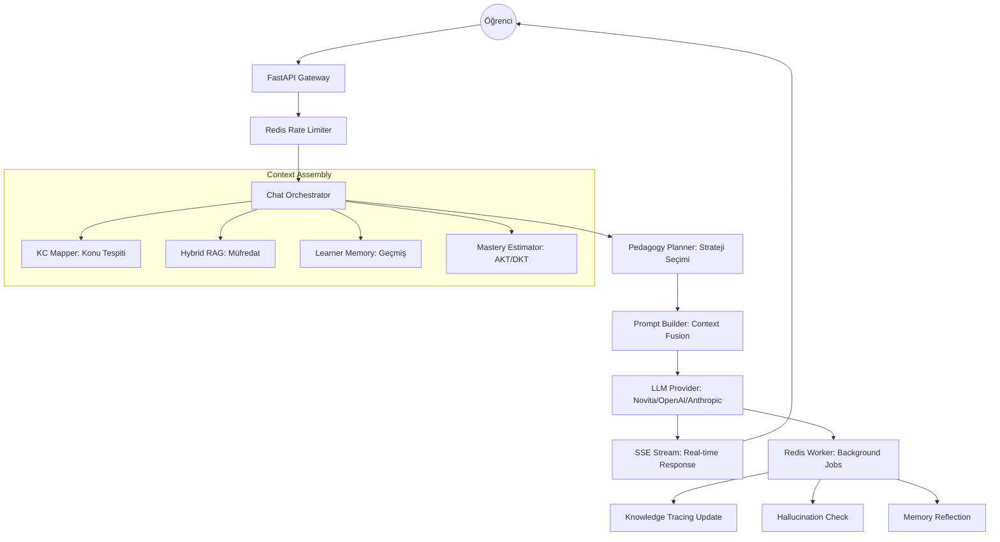

# Tutor Bot 🎓

Kişiselleştirilmiş AI tabanlı öğrenci asistanı. Öğrencinin bilgi seviyesini gerçek zamanlı izleyen, müfredat içeriğini RAG ile sorgulayan ve pedagojik strateji uygulayan adaptif öğrenme sistemi.

## 🚀 Öne Çıkan Özellikler

- **Adaptif Öğrenme**: AKT/DKT modelleri ile öğrencinin her konu için hakimiyet seviyesini (mastery) izler.
- **Hybrid Retrieval (RRF)**: Semantik (pgvector) ve anahtar kelime (pg_trgm) aramayı birleştirerek en doğru içeriği getirir.
- **Hallucination Monitoring**: LLM yanıtlarını kaynak dökümanlarla kıyaslayarak uydurma (hallucination) skorunu hesaplar.
- **SSE Streaming**: Yanıtları gerçek zamanlı (token-token) akıtır.
- **Multi-turn Quiz & Adaptive Difficulty**: Konu hakimiyetine göre zorluğu değişen çok aşamalı testler.
- **Production-Ready**: Rate limiting, structured logging, request tracing (X-Request-ID), ve Prometheus metrikleri.
- **Admin & Monitoring**: Öğrenci ilerlemesi, uydurma logları ve sistem sağlığı için detaylı dashboard verisi.

## 🏗️ Mimari Akış



## 🛠️ Kurulum

### Gereksinimler

- Python 3.11+
- Docker & Docker Compose
- Supabase projesi (Auth için)

### Hızlı Başlangıç

```bash
# 1. Ortam değişkenlerini ayarla
cp .env.example .env
# .env dosyasını düzenle (LLM_PROVIDER, API key ve Supabase bilgileri)

# 2. Servisleri ayağa kaldır
docker compose up -d --build

# 3. Veritabanı migrasyonlarını uygula
alembic upgrade head

# 4. Örnek müfredat yükle
python scripts/seed_curriculum.py
```

## 🔌 API Endpoint'leri

| Grup | Method | Path | Açıklama |
|---|---|---|---|
| **Chat** | `POST` | `/chat` | Senkron chat yanıtı |
| **Chat** | `POST` | `/chat/stream` | **SSE** gerçek zamanlı yanıt |
| **Quiz** | `POST` | `/quiz/generate` | Konu bazlı tek soru üret |
| **Quiz** | `POST` | `/quiz/generate-batch` | Çoklu soru (multi-turn) üret |
| **Quiz** | `POST` | `/quiz/generate-adaptive`| **Zorluğu ayarlanmış** soru üret |
| **Profile**| `GET` | `/profile/{id}` | Öğrenci profili ve konu hakimiyet tablosu |
| **Admin** | `GET` | `/admin/stats` | Sistem geneli kullanım istatistikleri |
| **Admin** | `GET` | `/admin/hallucination-logs`| Tespit edilen uydurma logları |
| **Admin** | `GET` | `/admin/learners` | Öğrenci ilerleme listesi |
| **Export** | `GET` | `/export/mastery/{id}/csv`| Mastery verilerini CSV olarak indir |
| **Upload** | `POST` | `/upload` | PDF/Docx döküman yükle ve RAG'a ekle |
| **Ops** | `GET` | `/metrics` | **Prometheus** metrikleri |
| **Ops** | `GET` | `/health` | Detaylı sağlık kontrolü (Redis, DB, DLQ) |

## 📊 İzleme ve Gözlemlenebilirlik

- **Prometheus Metrikleri**: `/metrics` üzerinden request latency, token kullanımı ve kuyruk derinliği izlenebilir.
- **Structured Logging**: Production ortamında `logging_json.py` ile ELK/Loki uyumlu JSON loglar üretilir.
- **Request Tracing**: Her isteğe atanan `X-Request-ID` ile loglar arası korelasyon sağlanır.
- **Health Probes**: Kubernetes uyumlu `/healthz` (liveness) ve `/readyz` (readiness) endpoint'leri mevcuttur.

## 🛡️ Güvenlik

- **Supabase JWT**: Tüm korumalı endpoint'lerde token doğrulaması yapılır.
- **Rate Limiting**: Redis tabanlı istek sınırlama (Chat: 60/dk, Login: 10/dk).
- **GDPR/KVKK**: `/profile/{id}` DELETE endpoint'i ile tüm kullanıcı verileri (Auth + DB) kalıcı olarak silinebilir.

## 🧪 Geliştirme ve Test

```bash
# Testleri çalıştır
pytest tests/ -v

# Değerlendirme scriptleri (RAG / KT / Hallucination)
python scripts/eval_retrieval.py
python scripts/eval_kt.py
python scripts/eval_hallucination.py
```

